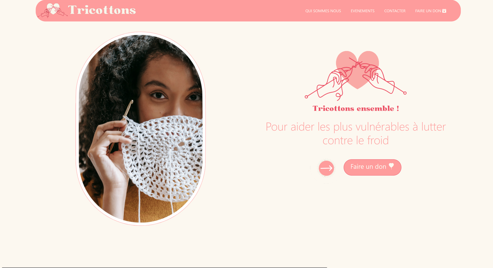
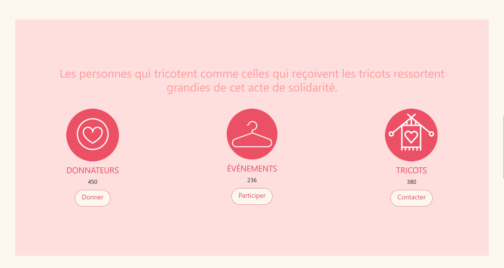
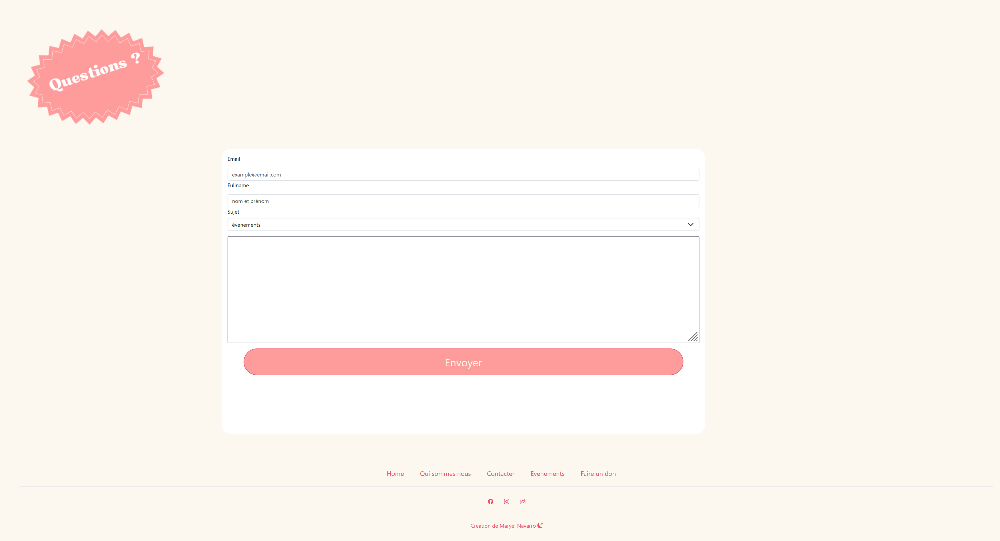
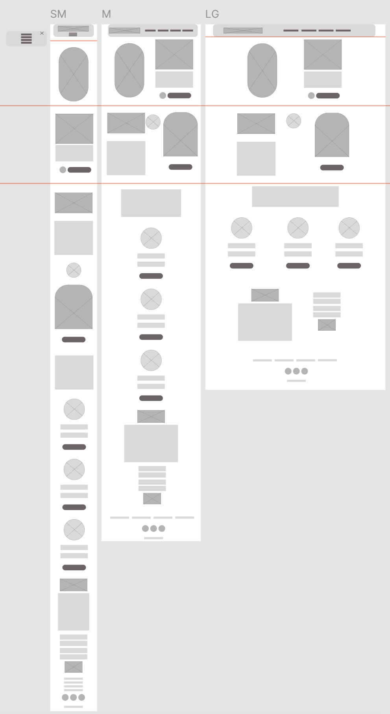

# TRICOTTONS Site Web

## Description du Projet

Le site web "TRICOTTONS" est une vitrine en ligne pour l'association Tricottons. Ce projet vise à créer une interface utilisateur statique et adaptable, permettant de donner plus de visibilité à l'association et d'encourager la participation aux événements ainsi que les dons.

Réalisé avec les technologies modernes telles que HTML, CSS, SASS, JavaScript, et Bootstrap, ce site offre une expérience utilisateur fluide et optimisée pour tous les appareils, suivant une logique "mobile-first".

## Contexte du Projet

Tricottons est une association à but non lucratif qui organise des rassemblements de tricot gratuits pour fabriquer des accessoires tricotés destinés aux personnes dans le besoin pendant la saison hivernale. Le site informe les utilisateurs sur l'association, présente les événements passés et futurs, et sollicite des dons pour soutenir la cause.

## Technologies Utilisées

- **HTML/CSS/Bootstrap** : Utilisation du framework Bootstrap pour fournir une grille réactive et des composants prêts à l'emploi, facilitant une mise en page rapide et cohérente.
- **SASS** : Pour la création de styles réutilisables et la gestion efficace des feuilles de style.
- **JavaScript** : Pour ajouter des fonctionnalités interactives et rendre le site plus attractif.
- **Docker** : Pour containeriser l'application, facilitant le déploiement et l'exécution sur différentes plateformes.


## Contenu

Le site se compose de 3 pages principales :

### 1. Page relative à l'association :
- **Présentation de l'association** : Détails sur l'association Tricottons, ses valeurs, et ses objectifs.
- **Formulaire de contact** : Permet aux visiteurs de contacter l'association.

### 2. Page publicitaire des événements nationaux :
- **Détails des événements** : Informations sur les événements à venir.
- **Photos des événements passés** : Galerie d'images pour illustrer les activités précédentes.
- **Google Maps** : Intégration de Google Maps pour localiser les événements.

### 3. Page de dons :
- **Appel à l'action** : Encourage les visiteurs à faire des dons pour soutenir l'association.
- **Informations sur les dons** : Explication des différentes manières de contribuer.

## Modalités

Le design de l'interface suit la logique "mobile-first", garantissant une expérience utilisateur optimale sur tous les appareils. Le site a été inspiré par "Le Blog Tricot - Tricots Solidaires".

## Screenshots

<div style="display: flex; flex-wrap: wrap; gap: 20px;">
    
    
     
</div>

<div style="display: flex; flex-wrap: wrap; gap: 20px; margin-top: 20px;">
    
</div>

## Exécution du Projet avec Docker

### Prérequis

- **Docker** doit être installé sur votre machine. Si ce n'est pas déjà fait, vous pouvez télécharger et installer Docker en suivant les instructions sur le site officiel : [Installer Docker](https://docs.docker.com/get-docker/).

### Étapes pour exécuter le projet localement

**Pour tirer l'image de ce projet depuis Docker Hub, exécutez la commande suivante :**
```sh
docker pull maryeln/web-tricots
```
**Pour exécuter le conteneur Docker et accéder au site web, utilisez la commande suivante :**
```sh
docker run -d -p 8080:80 maryeln/web-tricots
```

### Maquette et Wireframe

Les maquettes et wireframes du projet ont été conçus avec Figma pour visualiser et planifier l'interface utilisateur. Vous pouvez consulter ces conceptions détaillées 
[ici] [https://www.figma.com/file/lXbaDSTb07MylRIHjcXVTV/Untitled?type=design&node-id=3%3A697&mode=design&t=1AkzZ8pxSRLo9QEK-1 ](https://www.figma.com/design/lXbaDSTb07MylRIHjcXVTV/tricots-wireframe?node-id=0-1&t=hJk2mMdacTKXb7mq-1)

Comment Consulter le Projet

Le projet est aussi déployé avec GitHub Pages. Vous pouvez explorer le site en direct en suivant ce [lien vers la page GitHub Pages] https://maryeln.github.io/tricots-site/
